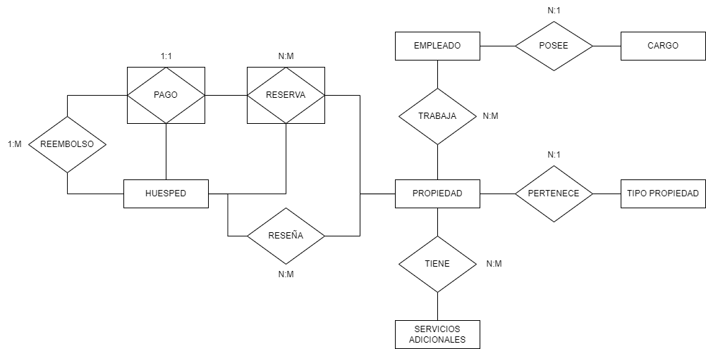

## Descripcion del negocio

"Viajemos Juntos" tiene como mision ofrecer experiencias de alojamiento inolvidables, brindando un servicio integral y de calidad en el alquiler de apartamentos, casas y habitaciones en toda Colombia. 

Se requiere la implementacion de una base de datos que tiene como objetivo centralizar y optimizar la gestion de los alquileres de propiedades. Esta herramienta permitira administrar eficientemente la informacion relacionada con empleados, propiedades, reservas, pagos, reseñas y estados de entrega. Ademas, facilitara la toma de decisiones estrategicas y mejorara la experiencia tanto para los huespedes como para los empleados.

Se requiere cubrir las siguientes necesidades:

### Gestion de Empleados:
- Registro detallado de empleados, incluyendo informacion como nombre, apellido, numero de identificacion, correo electronico y numero de telefono.
- Administracion de diferentes roles para empleados, como gerente, personal de limpieza, mantenimiento recepcionista, etc.
- Asignacion y seguimiento de propiedades a las que estan asignados los empleados.

### Gestion de Huespedes:
- Registro de huespedes con informacion relacionada como nombre, apellido, numero de identificacion, correo electronico y numero de telefono.

### Gestion de Propiedades:	
- Registro de nuevas propiedades con detalles como nombre, descripcion, ubicacion, numero de habitaciones, numero de baños, capacidad, etc.
- Cada propiedad puede tener varias imagenes.
- Cada propiedad puede tener varios servicios adicionales como Wifi, zona de trabajo, lavadora, secadora, camara de seguridad, etc.

### Gestion de Reservas:
- Creacion de nuevas reservas con informacion de fechas de inicio y finalizacion.
- Seguimiento del estado de las reservas (confirmada, pendiente, cancelada, completada).
- Calculo automatico del precio total de la reserva basado en la duracion de la estadia y el valor por noche.
  
### Gestion de Pagos:
- Registro de pagos asociados a reservas.
- Cada reserva puede ser cancelada, si se registro un pago de la reserva cancelada, este pago sera reembolsado.

### Gestion de Reseñas:
- Posibilidad para los usuarios huespedes de dejar comentarios y calificaciones en propiedades despues de una estancia.

### Gestion de reportes de entregas:
- Permitir a los empleados registrar el estado de entrega de la propiedad reservada. 

## Restricciones

### Empleados
- El correo electronico y telefono de cada empleado debe ser unico.
- Cada empleado debe poseer un cargo

### Propiedades:
- Si la propiedad es una habitacion, el numero de habitaciones de esta sera 1.
- El numero de habitaciones, baños y la capacidad de la propiedad deben ser valores enteros no negativos.
- El valor por noche de la propiedad no puede ser negativo.

### Huespedes
- Cada huesped debe tener un numero de identificacion unico (dni).
- El correo electronico de cada huesped debe ser unico.

### Imagenes de Propiedades
- Las imagenes deben pertenecer a una propiedad existente.

### Servicios Adicionales:
- Cada servicio adicional debe tener un nombre unico.

### Reservas:
- La fecha de inicio de la reserva debe ser anterior a la fecha de finalizacion.
- El estado de la reserva debe ser uno de los siguientes: "confirmada", "pendiente", "cancelada" o "completada".
- Si una reserva es confirmada, significa que se registro un pago.
- Una reserva en pendiente, no ha sido pagada.
- Si una reserva es completada, significa que el cliente realizo el pago y acudio a la estadia.
- Una reserva completada no podra ser reembolsada.
- Una reserva cancelada, registrara reembolso, solo si ha sido pagada, es decir se encontraba en estado confirmada.

### Pagos:
- La fecha de pago debe ser igual o posterior a la fecha de reserva.
- El valor del pago no puede ser negativo.

### Reembolsos:
- La fecha de reembolso debe ser igual o posterior a la fecha de pago asociada.
- El valor del reembolso se le descontara un 10% del valor pagado a la reserva que fue cancelada.

### Reseñas:
- La calificacion de la reseña debe estar en el rango de 1 a 5.
- Un huesped solo puede hacer una reseña por propiedad.

### Reporte Entrega:
- Solo los empleados recepcionista podran hacer reporte de entrega de la propiedad reservada.


## Diseño 
### Diagrama Entidad - Relacion


### Diagrama Relacional


## Consultas Base de Datos

### CRUD para Tabla Cargo
- Obtener todos los registros:
```sql
  SELECT * FROM cargo;
```

- Obtener registro por id:
```sql
  SELECT * FROM cargo WHERE idCargo = 1;
```

- Insertar registro:
```sql
    INSERT INTO cargo (nombre, descripcion) VALUES ('Gerente', 'Responsable de la gestion general');
```

- Actualizar registro:
```sql
    UPDATE cargo SET nombre = 'Gerente Ejecutivo' WHERE idCargo = 1;
```

- Eliminar registro:
```sql
    DELETE FROM cargo WHERE idCargo = 1;
```

### Consultas para Tabla Cargo

1. Encontrar el cargo con mas empleados.

```sql
DROP PROCEDURE IF EXISTS proc_obt_cargo_mas_empleados;
DELIMITER //
CREATE PROCEDURE proc_obt_cargo_mas_empleados()
BEGIN
    CREATE TEMPORARY TABLE IF NOT EXISTS temp_resultados (
        Cargo VARCHAR(40)
    );
    INSERT INTO temp_resultados (Cargo)
    SELECT nombre AS Cargo
    FROM cargo
    WHERE idCargo = (
        SELECT idCargo
        FROM empleado
        GROUP BY idCargo
        ORDER BY COUNT(idEmpleado) DESC
        LIMIT 1
    );
    IF (SELECT COUNT(*) FROM temp_resultados) = 0 THEN
        SELECT 'No hay resultados coincidentes' AS Mensaje;
    ELSE
        SELECT * FROM temp_resultados;
    END IF;
    DROP TEMPORARY TABLE IF EXISTS temp_resultados;
END //
DELIMITER ;
CALL proc_obt_cargo_mas_empleados();
```

2. Obtener cargo y nombre completo de los empleados que trabajan en una alguna propiedad ubicada en la ciudad solicitada.

```sql
DROP PROCEDURE IF EXISTS proc_obt_nombre_cargo_empleado_ciudad;
DELIMITER //
CREATE PROCEDURE proc_obt_nombre_cargo_empleado_ciudad(IN ciudad_solicitada VARCHAR(100))
BEGIN
    CREATE TEMPORARY TABLE IF NOT EXISTS temp_resultados (
        NombreCompleto VARCHAR(255),
        cargo VARCHAR(40)
    );
    INSERT INTO temp_resultados (NombreCompleto, cargo)
    SELECT DISTINCT CONCAT(em.nombres, ' ', em.apellidos) as NombreCompleto, c.nombre
    FROM cargo c, empleado em, trabajaEn tra
    WHERE c.idCargo = em.idCargo
    AND tra.idEmpleado = em.idEmpleado
    AND tra.idPropiedad IN (SELECT idPropiedad FROM ubicacionPropiedad WHERE LOWER(ciudad) = LOWER(ciudad_solicitada));

    IF (SELECT COUNT(*) FROM temp_resultados) = 0 THEN
        SELECT 'No hay resultados coincidentes' AS Mensaje;
    ELSE
        SELECT * FROM temp_resultados;
    END IF;
    DROP TEMPORARY TABLE IF EXISTS temp_resultados;
END //
DELIMITER ;
CALL proc_obt_nombre_cargo_empleado_ciudad('medellin');
```

3. Obtener nombre completo y cargo de los empleados trabajan en propiedades con un servicio solicitado.

```sql
DROP PROCEDURE IF EXISTS proc_obt_nombre_cargo_propiedadServicio;
DELIMITER //
CREATE PROCEDURE proc_obt_nombre_cargo_propiedadServicio(IN nombreServicio VARCHAR(50))
BEGIN
    CREATE TEMPORARY TABLE IF NOT EXISTS temp_resultados (
        NombreCompleto VARCHAR(255),
        cargo VARCHAR(40)
    );
    INSERT INTO temp_resultados (NombreCompleto, cargo)
	SELECT DISTINCT CONCAT(em.nombres, ' ', em.apellidos) as NombreCompleto, c.nombre
	FROM cargo c 
	JOIN empleado em ON c.idCargo = em.idCargo
	JOIN trabajaEn tra ON tra.idEmpleado = em.idEmpleado
	WHERE tra.idPropiedad IN (
		SELECT serp.idPropiedad FROM servicioPropiedad serp
		WHERE serp.idServicio IN (SELECT sera.idServicio FROM servicioAdicional  sera WHERE LOWER(sera.nombreServicio) = LOWER(nombreServicio))
	);
    
    IF (SELECT COUNT(*) FROM temp_resultados) = 0 THEN
        SELECT 'No hay resultados coincidentes' AS Mensaje;
    ELSE
		SELECT * FROM temp_resultados;
    END IF;
    DROP TEMPORARY TABLE IF EXISTS temp_resultados;
END //
DELIMITER ;
CALL proc_obt_nombre_cargo_propiedadServicio('gimnasio');
```

4. Obtener nombre, telefono y cargo de los empleados que han hecho un reporte de Entrega a una propiedad reservada en el mes de noviembre de cualquier año en la ciudad ingresada.

```sql
DROP PROCEDURE IF EXISTS proc_obt_nombre_cargo_propiedadServicio;
DELIMITER //
CREATE PROCEDURE proc_obt_nombre_cargo_propiedadServicio(IN nombreCiudad VARCHAR(50))
BEGIN
    CREATE TEMPORARY TABLE IF NOT EXISTS temp_resultados (
        NombreCompleto VARCHAR(255),
        telefono VARCHAR(20),
        cargo VARCHAR(40)
    );
    INSERT INTO temp_resultados (NombreCompleto, telefono, cargo)
	SELECT DISTINCT CONCAT(em.nombres, ' ', em.apellidos) as NombreCompleto, em.telefono, c.nombre
	FROM cargo c 
	JOIN empleado em ON c.idCargo = em.idCargo
	JOIN reporteEntrega rep ON em.idEmpleado = rep.idEmpleado
	JOIN reserva re ON re.idReserva = rep.idReserva
	JOIN ubicacionPropiedad ub ON ub.idPropiedad = re.idPropiedad
	WHERE re.idReserva IN (
		SELECT r.idReserva FROM reserva r WHERE DATE_FORMAT(r.fechaReserva, "%m") = 11)
	AND LOWER(ub.ciudad) = LOWER(nombreCiudad);

    IF (SELECT COUNT(*) FROM temp_resultados) = 0 THEN
        SELECT 'No hay resultados coincidentes' AS Mensaje;
    ELSE
		SELECT * FROM temp_resultados;
    END IF;
    DROP TEMPORARY TABLE IF EXISTS temp_resultados;
END //
DELIMITER ;
CALL proc_obt_nombre_cargo_propiedadServicio('bucaramanga');
```

5. Obtener el nombre cargo y propiedad en las que trabajen los empleados cuya descripcion de la propiedad que contenga la palabra ingresada.

```sql
DROP PROCEDURE IF EXISTS proc_obt_nombre_cargo_propiedad_xDescripcion;
DELIMITER //
CREATE PROCEDURE proc_obt_nombre_cargo_propiedad_xDescripcion(IN buscado VARCHAR(50))
BEGIN
    SET @terminoBuscado = buscado;

    CREATE TEMPORARY TABLE IF NOT EXISTS temp_resultados (
        NombreCompleto VARCHAR(255),
        cargo VARCHAR(40),
        descripcion TEXT
    );  

    PREPARE stmt FROM 
    'INSERT INTO temp_resultados (NombreCompleto, cargo, descripcion)
    SELECT CONCAT(em.nombres, " ", em.apellidos), c.nombre, pro.descripcion FROM cargo c, empleado em, trabajaEn tra, propiedad pro
    WHERE c.idCargo = em.idCargo
    AND em.idEmpleado = tra.idEmpleado
    AND pro.idPropiedad = tra.idPropiedad
    AND pro.descripcion LIKE CONCAT("%", ?, "%")';
    EXECUTE stmt USING @terminoBuscado;

    IF (SELECT COUNT(*) FROM temp_resultados) = 0 THEN
        SELECT 'No hay resultados coincidentes' AS Mensaje;
    ELSE
		SELECT * FROM temp_resultados;
    END IF;

    DROP TEMPORARY TABLE IF EXISTS temp_resultados;
END //
DELIMITER ;
CALL proc_obt_nombre_cargo_propiedad_xDescripcion('moderno');
```


### CRUD para Tabla Empleado
- Obtener todos los registros:
```sql
  SELECT * FROM empleado;
```

- Obtener registro por id:
```sql
  SELECT * FROM empleado WHERE idEmpleado = 1;
```

- Insertar registro:
```sql
    INSERT INTO empleado (dni,nombres,apellidos,telefono,email,idCargo) VALUES
  (25379094,'Isaac','Holland','894-9021','nisi.magna.sed@hotmail.couk',2);
```

- Actualizar registro:
```sql
    UPDATE empleado SET nombres = 'Isaac Norman' WHERE idEmpleado = 1;
```

- Eliminar registro:
```sql
    DELETE FROM empleado WHERE idEmpleado = 1;
```

### Consultas para Tabla Empleado
1. Obtener empleados que trabajen en propiedades que tengan al menos una imagen, permita mascotas y el numero de baños sea mayor o igual al ingresado.
   
```sql
DROP PROCEDURE IF EXISTS proc_obt_empleados_x_mascotas_banos;
DELIMITER //
CREATE PROCEDURE proc_obt_empleados_x_mascotas_banos(IN numBanosMinimo INT)
BEGIN
    CREATE TEMPORARY TABLE IF NOT EXISTS temp_resultados (
		idEmpleado int(11),
		dni varchar(15), 
		nombres varchar(40),
		apellidos varchar(40),
		telefono varchar(20),
		email varchar(60),
		idCargo int(11)
    );  
    INSERT INTO temp_resultados
	SELECT DISTINCT em.* FROM empleado em
	JOIN trabajaEn tra ON em.idEmpleado = tra.idEmpleado
	WHERE tra.idPropiedad IN (
		SELECT DISTINCT det.idPropiedad 
		FROM detallePropiedad det 
		WHERE LOWER(det.mascotas) = 'si' AND det.numBanos >= numBanosMinimo)
	AND tra.idPropiedad IN (
		SELECT DISTINCT img.idPropiedad 
		FROM imgpropiedad img);
        
    IF (SELECT COUNT(*) FROM temp_resultados) = 0 THEN
        SELECT 'No hay resultados coincidentes' AS Mensaje;
    ELSE
		SELECT * FROM temp_resultados;
    END IF;

    DROP TEMPORARY TABLE IF EXISTS temp_resultados;
END //
DELIMITER ;
CALL proc_obt_empleados_x_mascotas_banos(4);
```

2. Obtener el nombre de los empleados que realizaron un reporte de entrega, el id de de todas las reservas a las que realizaron el reporte separadas por '-' y el numero de reportes totales realizados por cada uno de ellos que debe ser mayor o igual al ingresado.

```sql
DROP PROCEDURE IF EXISTS proc_obt_empleados_y_reportes_x_numTotalReporte;
DELIMITER //
CREATE PROCEDURE proc_obt_empleados_y_reportes_x_numTotalReporte(IN numReportesMinimo INT)
BEGIN
    CREATE TEMPORARY TABLE IF NOT EXISTS temp_resultados (
		nombreCompleto VARCHAR(255),
        reportesId VARCHAR(255),
        numTotalReportes INTEGER
    );  
	
    INSERT INTO temp_resultados(nombreCompleto, reportesId, numTotalReportes)
	SELECT CONCAT(em.nombres, " ", em.apellidos), 
	GROUP_CONCAT(re.idReporte SEPARATOR ' - '), 
	COUNT(re.idReporte) 
	FROM empleado em, reporteEntrega re
	WHERE em.idEmpleado = re.idEmpleado
	AND em.idEmpleado IN (
		SELECT em.idEmpleado
		FROM empleado em, reporteEntrega re
		WHERE em.idEmpleado = re.idEmpleado
		GROUP BY em.nombres
		HAVING count(re.idReporte) >= numReportesMinimo)
	GROUP BY em.nombres;
        
    IF (SELECT COUNT(*) FROM temp_resultados) = 0 THEN
        SELECT 'No hay resultados coincidentes' AS Mensaje;
    ELSE
		SELECT * FROM temp_resultados;
    END IF;

    DROP TEMPORARY TABLE IF EXISTS temp_resultados;
END //
DELIMITER ;
CALL proc_obt_empleados_y_reportes_x_numTotalReporte(2);
```

3. Obtener todos los empleados que trabajen en una propiedad cuyo huesped haya realizado alguna cancelacion de reserva y cuyo nombre del huesped comience por la letra ingresada.

```sql
DROP PROCEDURE IF EXISTS proc_obt_empleados_con_pago_x_letra;
DELIMITER //
CREATE PROCEDURE proc_obt_empleados_con_pago_x_letra(IN letraIngresada CHAR(1))
BEGIN
    SET @letraBuscada = letraIngresada;

    CREATE TEMPORARY TABLE IF NOT EXISTS temp_resultados (
        idEmpleado INT,
        dni VARCHAR(15),
        nombres VARCHAR(40),
        apellidos VARCHAR(40),
        telefono VARCHAR(20),
        email VARCHAR(60),
        idCargo INT
    );

    PREPARE stmt FROM 
    'INSERT INTO temp_resultados(idEmpleado, dni, nombres, apellidos, telefono, email, idCargo)
    SELECT em.idEmpleado, em.dni, em.nombres, em.apellidos, em.telefono, em.email, em.idCargo
    FROM empleado em, trabajaen tra, propiedad pro, reserva re, huesped hu
    WHERE em.idEmpleado = tra.idEmpleado
    AND tra.idPropiedad = pro.idPropiedad
    AND re.idPropiedad = pro.idPropiedad
    AND re.idHuesped = hu.idHuesped
    AND re.idPropiedad IN (
        SELECT res.idPropiedad 
        FROM reserva res
        WHERE LOWER(res.estado) = "cancelado"
    )
    AND hu.idHuesped IN (
        SELECT hue.idHuesped 
        FROM huesped hue
        WHERE LOWER(LEFT(hue.nombres, 1)) = LOWER(LEFT(@letraBuscada, 1))
    )';
    EXECUTE stmt;
    IF (SELECT COUNT(*) FROM temp_resultados) = 0 THEN
        SELECT 'No hay resultados coincidentes' AS Mensaje;
    ELSE
        SELECT * FROM temp_resultados;
    END IF;

    DROP TEMPORARY TABLE IF EXISTS temp_resultados;
END //
DELIMITER ;
CALL proc_obt_empleados_con_pago_x_letra('F');
```

4. Obtener todos los empleados que trabajen en una propiedad que haya sido reseñada mas de 1 vez y tenga almenos una reservacion completada.

```sql
DROP PROCEDURE IF EXISTS proc_obt_empleados_con_reservaCompleta_totalResenas;
DELIMITER //
CREATE PROCEDURE proc_obt_empleados_con_reservaCompleta_totalResenas()
BEGIN
    CREATE TEMPORARY TABLE IF NOT EXISTS temp_resultados (
        idEmpleado INT,
        dni VARCHAR(15),
        nombres VARCHAR(40),
        apellidos VARCHAR(40),
        telefono VARCHAR(20),
        email VARCHAR(60),
        idCargo INT
    );

    PREPARE stmt FROM 
    'INSERT INTO temp_resultados(idEmpleado, dni, nombres, apellidos, telefono, email, idCargo)
	SELECT DISTINCT em.* FROM empleado em, trabajaEn tra
	WHERE em.idEmpleado = tra.idEmpleado
	AND tra.idPropiedad IN (
		SELECT DISTINCT re.idPropiedad FROM reserva re
		WHERE re.estado = "completada")
	AND tra.idPropiedad IN (
		SELECT res.idPropiedad FROM resena res
		GROUP BY res.idPropiedad
		HAVING COUNT(res.idPropiedad) > 1)';
    EXECUTE stmt;
    IF (SELECT COUNT(*) FROM temp_resultados) = 0 THEN
        SELECT 'No hay resultados coincidentes' AS Mensaje;
    ELSE
        SELECT * FROM temp_resultados;
    END IF;

    DROP TEMPORARY TABLE IF EXISTS temp_resultados;
END //
DELIMITER ;
CALL proc_obt_empleados_con_reservaCompleta_totalResenas();
```

5. Obtener el nombre y cargo de los empleados que trabajan en propiedades cuyo valor por noche supera el promedio y poseen mas de 2 servicios adicionales.

```sql
DROP PROCEDURE IF EXISTS proc_obt_empleados_x_masServicio_masValor;
DELIMITER //
CREATE PROCEDURE proc_obt_empleados_x_masServicio_masValor()
BEGIN
    CREATE TEMPORARY TABLE IF NOT EXISTS temp_resultados (
        nombreCompleto VARCHAR(40),
        cargo VARCHAR(40)
    );

	INSERT INTO temp_resultados(nombreCompleto, cargo)
	SELECT CONCAT(em.nombres, " ", em.apellidos), c.nombre FROM empleado em, cargo c, trabajaen tra, propiedad pro
	WHERE em.idCargo = c.idCargo
	AND tra.idEmpleado = em.idEmpleado
	AND tra.idPropiedad = pro.idPropiedad
	AND tra.idPropiedad IN (
		SELECT sp.idPropiedad 
		FROM servicioPropiedad sp 
		GROUP BY sp.idPropiedad 
		HAVING count(sp.idServicio) > 2)
	AND pro.valorxNoche > (
		SELECT AVG(pro.valorxNoche) 
		FROM propiedad pro);

    IF (SELECT COUNT(*) FROM temp_resultados) = 0 THEN
        SELECT 'No hay resultados coincidentes' AS Mensaje;
    ELSE
        SELECT * FROM temp_resultados;
    END IF;

    DROP TEMPORARY TABLE IF EXISTS temp_resultados;
END //
DELIMITER ;
CALL proc_obt_empleados_x_masServicio_masValor();
```


### CRUD para Tabla TrabajaEn
- Obtener todos los registros:
```sql
  SELECT * FROM trabajaEn;
```

- Obtener registro por idEmpleado o por idPropiedad:
```sql
  SELECT * FROM trabajaEn WHERE idEmpleado = 1;
  SELECT * FROM trabajaEn WHERE idPropiedad = 1;
```

- Insertar registro:
```sql
    INSERT INTO trabajaEn (idPropiedad, idEmpleado) VALUES (1, 5);
```

- Actualizar registro:
```sql
    UPDATE trabajaEn SET idPropiedad = 1 WHERE idEmpleado = 2;
```

- Eliminar registro por idEmpleado o idPropiedad:
```sql
    DELETE FROM trabajaEn WHERE idEmpleado = 1;
    DELETE FROM trabajaEn WHERE idPropiedad = 1;
```

### Consultas para Tabla TrabajaEn

1. Obtener descripcion de la propiedad y email de los empleados que trabajan en dicha propiedad, de las propiedades que tengan un numero de habitaciones inferior al promedio y esten ubicados en el departamento ingresado.

```sql
DROP PROCEDURE IF EXISTS proc_obt_trab_mayorPromedioHab_departamento;
DELIMITER //
CREATE PROCEDURE proc_obt_trab_mayorPromedioHab_departamento(IN nombre_departamento VARCHAR(100))
BEGIN
    CREATE TEMPORARY TABLE IF NOT EXISTS temp_resultados (
        descripcion TEXT,
        emailEmpleado VARCHAR(60)
    );

	INSERT INTO temp_resultados(descripcion, emailEmpleado)
	SELECT DISTINCT pro.descripcion, em.email FROM trabajaEn tra, propiedad pro, empleado em
	WHERE tra.idEmpleado = em.idEmpleado
	AND tra.idPropiedad = pro.idPropiedad
	AND tra.idPropiedad IN (
		SELECT det.idPropiedad 
		FROM detallePropiedad det
		WHERE det.numHabitaciones > (
			SELECT AVG(numHabitaciones) 
			FROM detallePropiedad
		))
	AND tra.idPropiedad IN (
		SELECT ub.idPropiedad 
		FROM ubicacionPropiedad ub
		WHERE LOWER(ub.departamento) = nombre_departamento
	);

    IF (SELECT COUNT(*) FROM temp_resultados) = 0 THEN
        SELECT 'No hay resultados coincidentes' AS Mensaje;
    ELSE
        SELECT * FROM temp_resultados;
    END IF;

    DROP TEMPORARY TABLE IF EXISTS temp_resultados;
END //
DELIMITER ;
CALL proc_obt_trab_mayorPromedioHab_departamento('antioquia');
```

2. Obtener los empleados que trabajan en propiedades que no tenga servicios adicionales y no tienen reservas en estado pendiente.

```sql
DROP PROCEDURE IF EXISTS proc_obt_noServicios_noReservaPendiente;
DELIMITER //
CREATE PROCEDURE proc_obt_noServicios_noReservaPendiente()
BEGIN
    CREATE TEMPORARY TABLE IF NOT EXISTS temp_resultados (
        idEmpleado INT,
        dni VARCHAR(15),
        nombres VARCHAR(40),
        apellidos VARCHAR(40),
        telefono VARCHAR(20),
        email VARCHAR(60),
        idCargo INT
    );

	INSERT INTO temp_resultados
	SELECT DISTINCT em.* FROM trabajaen tra
	JOIN empleado em ON em.idEmpleado = tra.idEmpleado
	JOIN propiedad pro ON pro.idPropiedad = tra.idPropiedad
	LEFT JOIN serviciopropiedad sep ON pro.idPropiedad = sep.idPropiedad
	WHERE sep.idPropiedad IS NULL
	AND tra.idPropiedad IN (
		SELECT propiedad.idPropiedad
		FROM propiedad
		LEFT JOIN reserva ON propiedad.idPropiedad = reserva.idPropiedad
		WHERE reserva.estado IS NULL OR reserva.estado != 'pendiente'
	);

    IF (SELECT COUNT(*) FROM temp_resultados) = 0 THEN
        SELECT 'No hay resultados coincidentes' AS Mensaje;
    ELSE
        SELECT * FROM temp_resultados;
    END IF;

    DROP TEMPORARY TABLE IF EXISTS temp_resultados;
END //
DELIMITER ;
CALL proc_obt_noServicios_noReservaPendiente();
```

3. Listar el/los empleados que trabajan en mas propiedades y que la descripcion de la propiedad posea mas de 45 caracteres, ordenarlos por nombre ascendentemente.

```sql
DROP PROCEDURE IF EXISTS proc_obt_trabajaMas_descripcionMayor;
DELIMITER //
CREATE PROCEDURE proc_obt_trabajaMas_descripcionMayor()
BEGIN
    CREATE TEMPORARY TABLE IF NOT EXISTS temp_resultados (
        idEmpleado INT,
        dni VARCHAR(15),
        nombres VARCHAR(40),
        apellidos VARCHAR(40),
        telefono VARCHAR(20),
        email VARCHAR(60),
        idCargo INT,
        totalPropiedadesTrabaja INTEGER
    );

	INSERT INTO temp_resultados
	SELECT em.*, COUNT(tra.idPropiedad)
	FROM empleado em
	JOIN trabajaEn tra ON em.idEmpleado = tra.idEmpleado
	JOIN propiedad pro ON tra.idPropiedad = pro.idPropiedad
	WHERE LENGTH(pro.descripcion) > 45
	GROUP BY em.idEmpleado, em.nombres, em.apellidos
	ORDER BY em.nombres ASC;

    IF (SELECT COUNT(*) FROM temp_resultados) = 0 THEN
        SELECT 'No hay resultados coincidentes' AS Mensaje;
    ELSE
        SELECT * FROM temp_resultados;
    END IF;
    DROP TEMPORARY TABLE IF EXISTS temp_resultados;
END //
DELIMITER ;
CALL proc_obt_trabajaMas_descripcionMayor();
```

4. Lista el nombre del empleado y nombre de los servicios por propiedad ordenarlos descentenmente por el nombre del servicio, ten en cuenta que pueden existir propiedades sin servicios adicionales.

```sql
DROP PROCEDURE IF EXISTS proc_obt_agrupacion_EmpleadoServicios;
DELIMITER //
CREATE PROCEDURE proc_obt_agrupacion_EmpleadoServicios()
BEGIN
    CREATE TEMPORARY TABLE IF NOT EXISTS temp_resultados (
        idPropiedad INT,
        nombres VARCHAR(100),
        totalPropiedadesTrabaja TEXT
    );

	INSERT INTO temp_resultados
	SELECT pro.idPropiedad, CONCAT(em.nombres, " ", em.apellidos),
		(
			SELECT GROUP_CONCAT(
				servicioAdicional.nombreServicio 
				ORDER BY servicioAdicional.nombreServicio DESC)
			FROM servicioPropiedad
			LEFT JOIN servicioAdicional ON servicioPropiedad.idServicio = servicioAdicional.idServicio
			WHERE servicioPropiedad.idPropiedad = pro.idPropiedad
		) AS servicios
	FROM empleado em
	JOIN trabajaEn tra ON em.idEmpleado = tra.idEmpleado
	JOIN propiedad pro ON tra.idPropiedad = pro.idPropiedad
	ORDER BY servicios DESC;

    IF (SELECT COUNT(*) FROM temp_resultados) = 0 THEN
        SELECT 'No hay resultados coincidentes' AS Mensaje;
    ELSE
        SELECT * FROM temp_resultados;
    END IF;
    DROP TEMPORARY TABLE IF EXISTS temp_resultados;
END //
DELIMITER ;
CALL proc_obt_agrupacion_EmpleadoServicios();
```

5. Encontrar las 5 propiedades con el mayor numero de reservas canceladas en el segundo semestre del año 2023 y mayor numero de empleados que trabajan en dichas propiedades.

```sql
DROP PROCEDURE IF EXISTS proc_obt_propiedadesEmpleados_masCanceladas_masEmpleados;
DELIMITER //
CREATE PROCEDURE proc_obt_propiedadesEmpleados_masCanceladas_masEmpleados()
BEGIN
    CREATE TEMPORARY TABLE IF NOT EXISTS temp_resultados (
        idPropiedad INT,
        descripcion TEXT,
        totalReservasCanceladas INTEGER,
        totalEmpleados INTEGER
    );

	INSERT INTO temp_resultados
	SELECT pro.idPropiedad, pro.descripcion,
		(
			SELECT COUNT(DISTINCT re.idReserva)
			FROM reserva re
			WHERE pro.idPropiedad = re.idPropiedad
				AND re.estado = 'cancelado'
				AND YEAR(re.fechaReserva) = 2023
				AND MONTH(re.fechaReserva) BETWEEN 7 AND 12
		) AS totalReservasCanceladas,
		(
			SELECT COUNT(DISTINCT tra.idEmpleado)
			FROM trabajaEn tra
			WHERE pro.idPropiedad = tra.idPropiedad
		) AS totalEmpleados
	FROM propiedad pro
	ORDER BY totalReservasCanceladas DESC, totalEmpleados DESC
	LIMIT 5;

    IF (SELECT COUNT(*) FROM temp_resultados) = 0 THEN
        SELECT 'No hay resultados coincidentes' AS Mensaje;
    ELSE
        SELECT * FROM temp_resultados;
    END IF;
    DROP TEMPORARY TABLE IF EXISTS temp_resultados;
END //
DELIMITER ;
CALL proc_obt_propiedadesEmpleados_masCanceladas_masEmpleados();
```


### CRUD para Tabla Propiedad
- Obtener todos los registros:
```sql
  SELECT * FROM propiedad;
```

- Obtener registro:
```sql
  SELECT * FROM propiedad WHERE idPropiedad = 1;
```

- Insertar registro:
```sql
    INSERT INTO propiedad (descripcion, valorxNoche) VALUES
    ('Hermosa casa con vista al mar', 600000);
```

- Actualizar registro:
```sql
    UPDATE propiedad SET descripcion = 'Hermosa casa con vista al mar' WHERE idPropiedad = 1;
```

- Eliminar registro por idEmpleado o idPropiedad:
```sql
    DELETE FROM propiedad WHERE idPropiedad = 1;
```

### Consultas para Tabla Propiedad
1. Obtener propiedades cuya reserva haya sido reembolsadas, y esten ubicadas en la ciudad ingresada.

```sql
DROP PROCEDURE IF EXISTS proc_obt_propiedades_con_reserva_ciudad;
DELIMITER //
CREATE PROCEDURE proc_obt_propiedades_con_reserva_ciudad(IN ciudadBuscada VARCHAR(40))
BEGIN
    CREATE TEMPORARY TABLE IF NOT EXISTS temp_resultados (
        idPropiedad int,
        descripcion TEXT,
        valorxNoche double 
    );

	INSERT INTO temp_resultados
    SELECT pro.* FROM propiedad pro, reserva re, pago pa, reembolso rem
    WHERE pro.idPropiedad = re.idPropiedad
    AND re.idReserva = pa.idReserva
    AND rem.idPago = pa.idPago
    AND pro.idPropiedad IN (
        SELECT ub.idPropiedad FROM ubicacionPropiedad ub
        WHERE ub.ciudad = ciudadBuscada
        );

    IF (SELECT COUNT(*) FROM temp_resultados) = 0 THEN
        SELECT 'No hay resultados coincidentes' AS Mensaje;
    ELSE
        SELECT * FROM temp_resultados;
    END IF;
    DROP TEMPORARY TABLE IF EXISTS temp_resultados;
END //
DELIMITER ;
CALL proc_obt_propiedades_con_reserva_ciudad('Bogota');
```

2. Obtener propiedades con el valor por noche incrementado un 10% si posee mas de un(1) servicio, si no posee servicios decrementarle un 10%.

```sql
DROP PROCEDURE IF EXISTS proc_obt_propiedadIncremento_x_servicios;
DELIMITER //
CREATE PROCEDURE proc_obt_propiedadIncremento_x_servicios()
BEGIN
    CREATE TEMPORARY TABLE IF NOT EXISTS temp_resultados (
        idPropiedad int,
        descripcion TEXT,
        valorxNoche double,
        nuevoValorxNoche double 
    );

	INSERT INTO temp_resultados
    SELECT idPropiedad, descripcion, valorxNoche,
        (
            CASE
                WHEN idPropiedad IN (
                    SELECT idPropiedad FROM servicioPropiedad) THEN 
                ROUND(valorxNoche * 1.1)
            ELSE 
                ROUND(valorxNoche * 0.9)
            END
        ) AS nuevoValorxNoche
    FROM propiedad;

    IF (SELECT COUNT(*) FROM temp_resultados) = 0 THEN
        SELECT 'No hay resultados coincidentes' AS Mensaje;
    ELSE
        SELECT * FROM temp_resultados;
    END IF;
    DROP TEMPORARY TABLE IF EXISTS temp_resultados;
END //
DELIMITER ;
CALL proc_obt_propiedadIncremento_x_servicios();
```

3. Obtener propiedades en las que se haya hecho una reseña con una calificacion inferior al promedio de calificaciones.

```sql
DROP PROCEDURE IF EXISTS proc_obt_propiedad_inferiorCalificacion;
DELIMITER //
CREATE PROCEDURE proc_obt_propiedad_inferiorCalificacion()
BEGIN
    CREATE TEMPORARY TABLE IF NOT EXISTS temp_resultados (
        idPropiedad int,
        descripcion TEXT,
        valorxNoche double
    );

	INSERT INTO temp_resultados
    SELECT * FROM propiedad pro
    WHERE pro.idPropiedad IN (
        SELECT DISTINCT idPropiedad FROM resena
        WHERE resena.calificacion >= (
            SELECT ROUND(AVG(re.calificacion)) 
            FROM resena re)
    );

    IF (SELECT COUNT(*) FROM temp_resultados) = 0 THEN
        SELECT 'No hay resultados coincidentes' AS Mensaje;
    ELSE
        SELECT * FROM temp_resultados;
    END IF;
    DROP TEMPORARY TABLE IF EXISTS temp_resultados;
END //
DELIMITER ;
CALL proc_obt_propiedad_inferiorCalificacion();
```

4. Obtener propiedades con capacidad de huespedes superior al promedio, adicional obten la suma de solo las habitaciones de las propiedades que cumplan dicha condicion.

```sql
DROP PROCEDURE IF EXISTS proc_obt_propiedad_mayorCapacidad_totalHabitaciones;
DELIMITER //
CREATE PROCEDURE proc_obt_propiedad_mayorCapacidad_totalHabitaciones()
BEGIN
    CREATE TEMPORARY TABLE IF NOT EXISTS temp_resultados (
        idPropiedad int,
        descripcion TEXT,
        capacidadHuespedes int,
        totalHabitaciones integer
    );

	INSERT INTO temp_resultados
    SELECT 
        p.idPropiedad,
        p.descripcion,
        dp.capacidadHuespedes,
        SUM(dp.numHabitaciones) AS totalHabitaciones
    FROM propiedad p
    JOIN detallePropiedad dp ON p.idPropiedad = dp.idPropiedad
    WHERE dp.capacidadHuespedes > (
        SELECT AVG(capacidadHuespedes)
        FROM detallePropiedad
    )
    GROUP BY p.idPropiedad, p.descripcion, dp.capacidadHuespedes;

    IF (SELECT COUNT(*) FROM temp_resultados) = 0 THEN
        SELECT 'No hay resultados coincidentes' AS Mensaje;
    ELSE
        SELECT * FROM temp_resultados;
    END IF;
    DROP TEMPORARY TABLE IF EXISTS temp_resultados;
END //
DELIMITER ;
CALL proc_obt_propiedad_mayorCapacidad_totalHabitaciones();
```

5. Obtener el valor por noche de aquellas propiedades que han sido canceladas por clientes que contengan la letra h en su nombre o apellido ordenado ascendentemente.

```sql
DROP PROCEDURE IF EXISTS proc_obt_propiedad_mayorCapacidad_totalHabitaciones;
DELIMITER //
CREATE PROCEDURE proc_obt_propiedad_mayorCapacidad_totalHabitaciones()
BEGIN
    CREATE TEMPORARY TABLE IF NOT EXISTS temp_resultados (
        idPropiedad int,
        descripcion TEXT,
        valorxNoche double,
        estado varchar(15),
        fechaReserva date,
        nombreHuesped varchar(50)
    );

	INSERT INTO temp_resultados
    SELECT 
        pro.*,
        re.estado,
        re.fechaReserva,
        CONCAT(hu.nombres, ' ', hu.apellidos) as NombreHuesped
    FROM propiedad pro
    JOIN reserva re ON pro.idPropiedad = re.idPropiedad
    JOIN huesped hu ON re.idHuesped = hu.idHuesped
    WHERE re.estado = 'cancelado' 
    AND (hu.nombres LIKE '%h%' OR hu.apellidos LIKE '%h%')
    ORDER BY hu.nombres ASC, hu.apellidos ASC;

    IF (SELECT COUNT(*) FROM temp_resultados) = 0 THEN
        SELECT 'No hay resultados coincidentes' AS Mensaje;
    ELSE
        SELECT * FROM temp_resultados;
    END IF;
    DROP TEMPORARY TABLE IF EXISTS temp_resultados;
END //
DELIMITER ;
CALL proc_obt_propiedad_mayorCapacidad_totalHabitaciones();
```

### CRUD para Tabla servicioPropiedad
- Obtener todos los registros:
```sql
  SELECT * FROM servicioPropiedad;
```

- Obtener registro por propiedad:
- Obtener registro por servicio:
```sql
  SELECT * FROM servicioPropiedad WHERE idPropiedad = 1;
  SELECT * FROM servicioPropiedad WHERE idServicio = 1;
```

- Insertar registro:
```sql
    INSERT INTO servicioPropiedad (idPropiedad, idServicio)
    VALUES (1, 5);
```

- Actualizar registro:
```sql
    UPDATE servicioPropiedad SET idServicio = 2 WHERE idPropiedad = 15;
```

- Eliminar registro por idEmpleado o idPropiedad:
```sql
    DELETE FROM servicioPropiedad WHERE idServicio = 1;
```

### Consultas para Tabla servicioPropiedad

1. Obtener servicios junto con un ID unico generado de la combinacion de los primeros 2 caracteres del nombre del servicio, el id primario del servicio y numero de caracteres de la descripcion.

```sql
DROP PROCEDURE IF EXISTS proc_obt_idServicioUnicoGenerado;
DELIMITER //
CREATE PROCEDURE proc_obt_idServicioUnicoGenerado()
BEGIN
    CREATE TEMPORARY TABLE IF NOT EXISTS temp_resultados (
        idServicio INT,
        nombreServicio VARCHAR(50),
        idUnicoGenerado TEXT
    );

	INSERT INTO temp_resultados (idServicio, nombreServicio, idUnicoGenerado)
    SELECT DISTINCT 
        sa.idServicio,
        sa.nombreServicio, 
        CONCAT(
            UPPER(LEFT(sa.nombreServicio, 2)),
            sa.idServicio,
            LENGTH(sa.descripcion)
        ) as ID
    FROM servicioPropiedad sp
    JOIN servicioAdicional sa ON sp.idServicio = sa.idServicio;

    IF (SELECT COUNT(*) FROM temp_resultados) = 0 THEN
        SELECT 'No hay resultados coincidentes' AS Mensaje;
    ELSE
        SELECT * FROM temp_resultados;
    END IF;
    DROP TEMPORARY TABLE IF EXISTS temp_resultados;
END //
DELIMITER ;
CALL proc_obt_idServicioUnicoGenerado();
```

2. Obtener la propiedad con mas servicios adicionales que sea de tipo casa y no permita mascotas.

```sql

DROP PROCEDURE IF EXISTS proc_obt_propiedadCasa_masServicios_mascotasSi;
DELIMITER //
CREATE PROCEDURE proc_obt_propiedadCasa_masServicios_mascotasSi()
BEGIN
    CREATE TEMPORARY TABLE IF NOT EXISTS temp_resultados (
        idPropiedad INT,
        descripcionPropiedad VARCHAR(50),
        totalServicios INTEGER,
        permiteMascotas VARCHAR(10)
    );

	INSERT INTO temp_resultados (idPropiedad, descripcionPropiedad, totalServicios, permiteMascotas)
    SELECT pro.idPropiedad, (
        SELECT descripcion 
        FROM propiedad 
        WHERE propiedad.idPropiedad = pro.idPropiedad
    ) ,
        count(sep.idServicio),
        det.mascotas
    FROM propiedad pro
    LEFT JOIN servicioPropiedad sep ON sep.idPropiedad = pro.idPropiedad
    JOIN detallePropiedad det ON det.idPropiedad = pro.idPropiedad
    WHERE det.tipoPropiedad = 'apartamento' and det.mascotas = 'si'
    GROUP BY pro.idPropiedad
    ORDER BY count(sep.idServicio) DESC
    LIMIT 1;

    IF (SELECT COUNT(*) FROM temp_resultados) = 0 THEN
        SELECT 'No hay resultados coincidentes' AS Mensaje;
    ELSE
        SELECT * FROM temp_resultados;
    END IF;
    DROP TEMPORARY TABLE IF EXISTS temp_resultados;
END //
DELIMITER ;
CALL proc_obt_propiedadCasa_masServicios_mascotasSi();
```

3. Obtener la propiedad mas economica, con menos servicios y que tenga almenos una reserva.

```sql
DROP PROCEDURE IF EXISTS proc_obt_propiedad_masEconomica_masServicios_masReservas;
DELIMITER //
CREATE PROCEDURE proc_obt_propiedad_masEconomica_masServicios_masReservas()
BEGIN
    CREATE TEMPORARY TABLE IF NOT EXISTS temp_resultados (
        idPropiedad INT,
        descripcionPropiedad VARCHAR(255),
        valorPorNoche DOUBLE,
        totalReservas INT,
        totalServicios INT
    );

    INSERT INTO temp_resultados (idPropiedad, descripcionPropiedad, valorPorNoche, totalReservas, totalServicios)
    SELECT 
        p.idPropiedad, 
        p.descripcion, 
        p.valorxNoche, 
        COUNT(r.idReserva) AS totalReservas, 
        COUNT(sp.idServicio) AS totalServicios
    FROM propiedad p
    JOIN reserva r ON p.idPropiedad = r.idPropiedad
    LEFT JOIN servicioPropiedad sp ON p.idPropiedad = sp.idPropiedad
    GROUP BY p.idPropiedad
    HAVING COUNT(r.idReserva) >= 1
    ORDER BY p.valorxNoche
    LIMIT 1;


    IF (SELECT COUNT(*) FROM temp_resultados) = 0 THEN
        SELECT 'No hay resultados coincidentes' AS Mensaje;
    ELSE
        SELECT * FROM temp_resultados;
    END IF;
    DROP TEMPORARY TABLE IF EXISTS temp_resultados;
END //
DELIMITER ;
CALL proc_obt_propiedad_masEconomica_masServicios_masReservas();
```

4. Obtener la propiedad con menos servicios y mas dias de estancia en una reserva que se encuentre en estado completada.

```sql

DROP PROCEDURE IF EXISTS proc_obt_propiedad_menosServicios_masDiasEstancia;
DELIMITER //
CREATE PROCEDURE proc_obt_propiedad_menosServicios_masDiasEstancia()
BEGIN
    CREATE TEMPORARY TABLE IF NOT EXISTS temp_resultados (
        idPropiedad INT,
        descripcionPropiedad VARCHAR(255),
        valorPorNoche DOUBLE,
        totalReservas INT,
        totalServicios INT
    );

    INSERT INTO temp_resultados (idPropiedad, descripcionPropiedad, valorPorNoche, totalReservas, totalServicios)
    SELECT p.idPropiedad, p.descripcion, p.valorxNoche, COUNT(sp.idServicio) AS totalServicios, r.diasEstancia
    FROM propiedad p
    JOIN reserva r ON p.idPropiedad = r.idPropiedad
    LEFT JOIN servicioPropiedad sp ON p.idPropiedad = sp.idPropiedad
    WHERE r.estado = 'completada'
    GROUP BY p.idPropiedad, p.descripcion, r.diasEstancia
    ORDER BY totalServicios ASC, r.diasEstancia DESC
    LIMIT 1;

    IF (SELECT COUNT(*) FROM temp_resultados) = 0 THEN
        SELECT 'No hay resultados coincidentes' AS Mensaje;
    ELSE
        SELECT * FROM temp_resultados;
    END IF;
    DROP TEMPORARY TABLE IF EXISTS temp_resultados;
END //
DELIMITER ;
CALL proc_obt_propiedad_menosServicios_masDiasEstancia();
```

5. Obtener el valor por noche de las propiedades, multiplicado por el numero de servicios adicionales que posee la propiedad. 

```sql
DROP PROCEDURE IF EXISTS proc_obt_incrementoValorxServicios;
DELIMITER //
CREATE PROCEDURE proc_obt_incrementoValorxServicios()
BEGIN
    CREATE TEMPORARY TABLE IF NOT EXISTS temp_resultados (
        idPropiedad INT,
        valorTotal DOUBLE
    );
    INSERT INTO temp_resultados (idPropiedad, valorTotal)
    SELECT 
        p.idPropiedad, 
        p.valorxNoche * COUNT(sp.idServicio) AS valor_total
    FROM propiedad p
    LEFT JOIN servicioPropiedad sp ON p.idPropiedad = sp.idPropiedad
    GROUP BY p.idPropiedad, p.descripcion, p.valorxNoche;
    

    IF (SELECT COUNT(*) FROM temp_resultados) = 0 THEN
        SELECT 'No hay resultados coincidentes' AS Mensaje;
    ELSE
        SELECT * FROM temp_resultados;
    END IF;
    DROP TEMPORARY TABLE IF EXISTS temp_resultados;
END //
DELIMITER ;
CALL proc_obt_incrementoValorxServicios();
```

### CRUD para Tabla servicioAdicional
- Obtener todos los registros:
```sql
  SELECT * FROM servicioAdicional;
```

- Obtener registro:
```sql
  SELECT * FROM servicioPropiedad WHERE idServicio = 1;
```

- Insertar registro:
```sql
    INSERT INTO servicioAdicional (nombreServicio, descripcion) VALUES
    ('Wi-Fi', 'Conexion de alta velocidad');
```

- Actualizar registro:
```sql
    UPDATE servicioAdicional SET nombreServicio = "Internet Inalambrico" WHERE idServicio = 1;
```

- Eliminar registro por idEmpleado o idPropiedad:
```sql
    DELETE FROM servicioAdicional WHERE idServicio = 5;
```

### Consultas para Tabla servicioAdicional

1. Obtener el promedio de caracteres de la descripcion de los servicios adicionales, si la longitud de la descripcion del servicio adicional es menor al promedio indicar "inferior", en caso contrario "superior".

```sql
DROP PROCEDURE IF EXISTS proc_obt_longitudPromedioDescripcionServicio;
DELIMITER //
CREATE PROCEDURE proc_obt_longitudPromedioDescripcionServicio()
BEGIN
    CREATE TEMPORARY TABLE IF NOT EXISTS temp_resultados (
		idServicio INT,
		descripcion VARCHAR(255),
		longitud_descripcion INT,
		comparacion VARCHAR(10)
    );
    
	INSERT INTO temp_resultados
	SELECT
		idServicio,
		descripcion,
		LENGTH(descripcion) AS longitud_descripcion,
		CASE
		WHEN LENGTH(descripcion) < (
		  SELECT AVG(LENGTH(descripcion)) FROM servicioAdicional
		) THEN 'inferior'
		ELSE 'superior'
	END AS comparacion
	FROM servicioAdicional;

    IF (SELECT COUNT(*) FROM temp_resultados) = 0 THEN
        SELECT 'No hay resultados coincidentes' AS Mensaje;
    ELSE
        SELECT * FROM temp_resultados;
    END IF;
    DROP TEMPORARY TABLE IF EXISTS temp_resultados;
END //
DELIMITER ;
CALL proc_obt_longitudPromedioDescripcionServicio();
```

2. Obtener los servicios adicionales de propiedades que han sido reservadas por clientes que han realizado almenos una reserva y cuya reserva se encuentre en estado confirmado o completada.

```sql
DROP PROCEDURE IF EXISTS proc_obt_servicios_conReserva_confirmadoCompletada;
DELIMITER //
CREATE PROCEDURE proc_obt_servicios_conReserva_confirmadoCompletada()
BEGIN
    CREATE TEMPORARY TABLE IF NOT EXISTS temp_resultados (
	  idServicio INT,
	  nombreServicio VARCHAR(50)
    );
    
	INSERT INTO temp_resultados
	SELECT DISTINCT sp.idServicio, sa.nombreServicio
	FROM servicioPropiedad sp
	JOIN reserva r ON sp.idPropiedad = r.idPropiedad
	JOIN (
		SELECT idHuesped
		FROM reserva
		WHERE estado IN ('confirmado', 'completada')
		GROUP BY idHuesped
		HAVING COUNT(idReserva) >= 1
	) clientes_multireserva ON r.idHuesped = clientes_multireserva.idHuesped
	JOIN servicioAdicional sa ON sp.idServicio = sa.idServicio
	WHERE r.estado IN ('confirmado', 'completada')
	ORDER BY sp.idServicio;

    IF (SELECT COUNT(*) FROM temp_resultados) = 0 THEN
        SELECT 'No hay resultados coincidentes' AS Mensaje;
    ELSE
        SELECT * FROM temp_resultados;
    END IF;
    DROP TEMPORARY TABLE IF EXISTS temp_resultados;
END //
DELIMITER ;
CALL proc_obt_servicios_conReserva_confirmadoCompletada();
```

3. Obtener los servicios adicionales que han sido reservados en propiedades sin importar el estado de la reserva, que permiten mascotas y son propiedades de tipo apartamento.

```sql
DROP PROCEDURE IF EXISTS proc_obt_servicios_conReserva_mascotasApartamento;
DELIMITER //
CREATE PROCEDURE proc_obt_servicios_conReserva_mascotasApartamento()
BEGIN
    CREATE TEMPORARY TABLE IF NOT EXISTS temp_resultados (
	  idServicio INT,
	  nombreServicio VARCHAR(50)
    );
    
	INSERT INTO temp_resultados
	SELECT DISTINCT sp.idServicio, sa.nombreServicio
	FROM servicioPropiedad sp
	JOIN (
		SELECT prop.idPropiedad
		FROM propiedad prop
		JOIN detallePropiedad det ON prop.idPropiedad = det.idPropiedad
		WHERE det.mascotas = 'si' AND det.tipoPropiedad = 'apartamento'
	) as apart ON sp.idPropiedad = apart.idPropiedad
	JOIN servicioAdicional sa ON sp.idServicio = sa.idServicio;

    IF (SELECT COUNT(*) FROM temp_resultados) = 0 THEN
        SELECT 'No hay resultados coincidentes' AS Mensaje;
    ELSE
        SELECT * FROM temp_resultados;
    END IF;
    DROP TEMPORARY TABLE IF EXISTS temp_resultados;
END //
DELIMITER ;
CALL proc_obt_servicios_conReserva_mascotasApartamento();
```

4. Obtener servicios adicionales de propiedades reservadas en el mes de noviembre de cualquier año.

```sql
DROP PROCEDURE IF EXISTS proc_obt_servicios_conReservaNoviembre;
DELIMITER //
CREATE PROCEDURE proc_obt_servicios_conReservaNoviembre()
BEGIN
    CREATE TEMPORARY TABLE IF NOT EXISTS temp_resultados (
	  idServicio INT,
	  nombreServicio VARCHAR(50)
    );
    
	INSERT INTO temp_resultados
	SELECT DISTINCT sp.idServicio, sa.nombreServicio
	FROM servicioPropiedad sp
	JOIN (
		SELECT idPropiedad
		FROM reserva
		WHERE MONTH(fechaReserva) = 11
	) prop_subc ON sp.idPropiedad = prop_subc.idPropiedad
	JOIN servicioAdicional sa ON sp.idServicio = sa.idServicio;

    IF (SELECT COUNT(*) FROM temp_resultados) = 0 THEN
        SELECT 'No hay resultados coincidentes' AS Mensaje;
    ELSE
        SELECT * FROM temp_resultados;
    END IF;
    DROP TEMPORARY TABLE IF EXISTS temp_resultados;
END //
DELIMITER ;
CALL proc_obt_servicios_conReservaNoviembre();
```

5. Obtener una agrupacion por mes de los servicios adicionales de las propiedades reservadas en estado pendiente.

```sql
DROP PROCEDURE IF EXISTS proc_obt_serviciosAgrupados_por_mes_pendientes;
DELIMITER //
CREATE PROCEDURE proc_obt_serviciosAgrupados_por_mes_pendientes()
BEGIN
    CREATE TEMPORARY TABLE IF NOT EXISTS temp_resultados (
	  mes INT,
	  nombreServicio VARCHAR(50),
	  cantidad_reservas INT
    );
    
	INSERT INTO temp_resultados
	SELECT
		MONTH(r.fechaReserva) AS mes,
		GROUP_CONCAT(sa.nombreServicio ORDER BY sa.nombreServicio ASC) AS servicios,
		COUNT(*) AS cantidad_reservas
	FROM servicioPropiedad sp
	JOIN(
			SELECT idPropiedad
			FROM reserva
			WHERE estado = 'pendiente'
		) prop ON sp.idPropiedad = prop.idPropiedad
	JOIN
		reserva r ON sp.idPropiedad = r.idPropiedad
	JOIN
		servicioAdicional sa ON sp.idServicio = sa.idServicio
	GROUP BY mes
	ORDER BY mes, cantidad_reservas DESC;

    IF (SELECT COUNT(*) FROM temp_resultados) = 0 THEN
        SELECT 'No hay resultados coincidentes' AS Mensaje;
    ELSE
        SELECT * FROM temp_resultados;
    END IF;
    DROP TEMPORARY TABLE IF EXISTS temp_resultados;
END //
DELIMITER ;
CALL proc_obt_serviciosAgrupados_por_mes_pendientes();
```

### CRUD para Tabla imgPropiedad
- Obtener todos los registros:
```sql
  SELECT * FROM imgPropiedad;
```

- Obtener registro:
```sql
  SELECT * FROM imgPropiedad WHERE idPropiedad = 1;
```

- Insertar registro:
```sql
    INSERT INTO imgPropiedad (idImgPropiedad, idPropiedad, urlImagen, descripcion) VALUES
    (1, 1, 'https://a0.muscache.com/im/pictures/a1399e86-4cba-44fe-9099-80e5a6717f87.jpg?im_w=720', 'Vista frontal casa');
```

- Actualizar registro:
```sql
    UPDATE imgPropiedad SET descripcion = "Jardin trasero" WHERE idImgPropiedad = 1;
```

- Eliminar registro:
```sql
    DELETE FROM imgPropiedad WHERE idImgPropiedad = 5;
```

### Consultas para Tabla servicioAdicional

1. Listar las imagenes de propiedades que estan asociadas a propiedades con mas de 2 servicios adicionales.

```sql
DROP PROCEDURE IF EXISTS proc_obt_imgPropiedad_masServicios;
DELIMITER //
CREATE PROCEDURE proc_obt_imgPropiedad_masServicios()
BEGIN
    CREATE TEMPORARY TABLE IF NOT EXISTS temp_resultados (
	  idImgPropiedad INT PRIMARY KEY AUTO_INCREMENT,
	  idPropiedad INT NOT NULL,
	  urlImagen VARCHAR(255) NOT NULL,
	  descripcion VARCHAR(255) NOT NULL
    );
    
	INSERT INTO temp_resultados
	SELECT ip.*
	FROM imgPropiedad ip
	JOIN propiedad p ON ip.idPropiedad = p.idPropiedad
	JOIN (
		SELECT idPropiedad
		FROM servicioPropiedad
		GROUP BY idPropiedad
		HAVING COUNT(idServicio) > 2
	) prop ON p.idPropiedad = prop.idPropiedad;

    IF (SELECT COUNT(*) FROM temp_resultados) = 0 THEN
        SELECT 'No hay resultados coincidentes' AS Mensaje;
    ELSE
        SELECT * FROM temp_resultados;
    END IF;
    DROP TEMPORARY TABLE IF EXISTS temp_resultados;
END //
DELIMITER ;
CALL proc_obt_imgPropiedad_masServicios();
```

2. Obtener las imagenes de propiedades que estan asociadas a propiedades con la menor cantidad de reservas pendientes.

```sql
DROP PROCEDURE IF EXISTS proc_obt_imgPropiedad_menosPendientes;
DELIMITER //
CREATE PROCEDURE proc_obt_imgPropiedad_menosPendientes()
BEGIN
    CREATE TEMPORARY TABLE IF NOT EXISTS temp_resultados (
	  idImgPropiedad INT PRIMARY KEY AUTO_INCREMENT,
	  idPropiedad INT NOT NULL,
	  urlImagen VARCHAR(255) NOT NULL,
	  descripcion VARCHAR(255) NOT NULL
    );
    
	INSERT INTO temp_resultados
	SELECT ip.*
	FROM imgPropiedad ip
	JOIN propiedad p ON ip.idPropiedad = p.idPropiedad
	JOIN (
		SELECT idPropiedad, COUNT(idReserva) AS totalReservas
		FROM reserva
		WHERE estado = 'pendiente'
		GROUP BY idPropiedad
		ORDER BY totalReservas ASC
		LIMIT 1
	) prop ON p.idPropiedad = prop.idPropiedad
	ORDER BY prop.totalReservas ASC
	LIMIT 1;

    IF (SELECT COUNT(*) FROM temp_resultados) = 0 THEN
        SELECT 'No hay resultados coincidentes' AS Mensaje;
    ELSE
        SELECT * FROM temp_resultados;
    END IF;
    DROP TEMPORARY TABLE IF EXISTS temp_resultados;
END //
DELIMITER ;
CALL proc_obt_imgPropiedad_menosPendientes();
```

3. Listar las imagenes de propiedades que estan asociadas a propiedades con reservas canceladas en los ultimos 15 dias.

```sql
DROP PROCEDURE IF EXISTS proc_obt_imgPropiedad_canceladasUltimosdias;
DELIMITER //
CREATE PROCEDURE proc_obt_imgPropiedad_canceladasUltimosdias(IN dias_atras INT)
BEGIN
    CREATE TEMPORARY TABLE IF NOT EXISTS temp_resultados (
	  idImgPropiedad INT PRIMARY KEY AUTO_INCREMENT,
	  idPropiedad INT NOT NULL,
	  urlImagen VARCHAR(255) NOT NULL,
	  descripcion VARCHAR(255) NOT NULL
    );
    
	INSERT INTO temp_resultados
	SELECT DISTINCT ip.*
	FROM imgPropiedad ip
	JOIN propiedad p ON ip.idPropiedad = p.idPropiedad
	JOIN (
		SELECT idPropiedad
		FROM reserva
		WHERE estado = 'cancelado' AND DATEDIFF(CURDATE(), fechaReserva) <= dias_atras
	) prop ON p.idPropiedad = prop.idPropiedad
	JOIN reserva r ON p.idPropiedad = r.idPropiedad;

    IF (SELECT COUNT(*) FROM temp_resultados) = 0 THEN
        SELECT 'No hay resultados coincidentes' AS Mensaje;
    ELSE
        SELECT * FROM temp_resultados;
    END IF;
    DROP TEMPORARY TABLE IF EXISTS temp_resultados;
END //
DELIMITER ;
CALL proc_obt_imgPropiedad_canceladasUltimosdias(15);
```

4. Obtener imagenes de propiedades donde trabajen menos de 3 empleados y al menos uno de ellos es de cargo recepcionista.

```sql
DROP PROCEDURE IF EXISTS proc_obt_imgPropiedad_x_empledaoRecepcionista;
DELIMITER //
CREATE PROCEDURE proc_obt_imgPropiedad_x_empledaoRecepcionista()
BEGIN
    CREATE TEMPORARY TABLE IF NOT EXISTS temp_resultados (
	  idImgPropiedad INT PRIMARY KEY AUTO_INCREMENT,
	  idPropiedad INT NOT NULL,
	  urlImagen VARCHAR(255) NOT NULL,
	  descripcion VARCHAR(255) NOT NULL
    );
    
	INSERT INTO temp_resultados
	SELECT DISTINCT ip.*
	FROM imgPropiedad ip
	JOIN propiedad p ON ip.idPropiedad = p.idPropiedad
	JOIN trabajaEn t ON p.idPropiedad = t.idPropiedad
	JOIN empleado e ON t.idEmpleado = e.idEmpleado
	WHERE e.idCargo = (
		SELECT idCargo 
		FROM cargo 
		WHERE nombre = 'recepcionista')
	GROUP BY ip.idImgPropiedad
	HAVING COUNT(t.idEmpleado) < 3;


    IF (SELECT COUNT(*) FROM temp_resultados) = 0 THEN
        SELECT 'No hay resultados coincidentes' AS Mensaje;
    ELSE
        SELECT * FROM temp_resultados;
    END IF;
    DROP TEMPORARY TABLE IF EXISTS temp_resultados;
END //
DELIMITER ;
CALL proc_obt_imgPropiedad_x_empledaoRecepcionista();
```

5. Obtener los diferentes dominios de las url de las imagenes de las propiedades.

```sql
DROP PROCEDURE IF EXISTS proc_obt_dominioUrlImgPropiedad;
DELIMITER //
CREATE PROCEDURE proc_obt_dominioUrlImgPropiedad()
BEGIN
    CREATE TEMPORARY TABLE IF NOT EXISTS temp_resultados (
	  dominioUrlImagen VARCHAR(255) NOT NULL
    );
    
	INSERT INTO temp_resultados
	SELECT DISTINCT 
    SUBSTRING_INDEX(SUBSTRING_INDEX(ip.urlImagen, '/', 3), '//', -1) AS dominio
	FROM imgPropiedad ip;

    IF (SELECT COUNT(*) FROM temp_resultados) = 0 THEN
        SELECT 'No hay resultados coincidentes' AS Mensaje;
    ELSE
        SELECT * FROM temp_resultados;
    END IF;
    DROP TEMPORARY TABLE IF EXISTS temp_resultados;
END //
DELIMITER ;
CALL proc_obt_dominioUrlImgPropiedad();
```

### CRUD para Tabla detallePropiedad
- Obtener todos los registros:
```sql
  SELECT * FROM detallePropiedad;
```

- Obtener registro:
```sql
  SELECT * FROM detallePropiedad WHERE idPropiedad = 1;
```

- Insertar registro:
```sql
    INSERT INTO detallePropiedad (idPropiedad, capacidadHuespedes, numHabitaciones, mascotas, numBanos, tipoPropiedad) VALUES
    (1, 8, 4, 'si', 3, 'casa');
```

- Actualizar registro:
```sql
    UPDATE detallePropiedad SET numHabitaciones = 15 WHERE idPropiedad = 1;
```

- Eliminar registro:
```sql
    DELETE FROM detallePropiedad WHERE idPropiedad = 5;
```

### Consultas para Tabla detallePropiedad

1. Obtener propiedades que tienen reservas confirmadas y una capacidad de huéspedes superior al promedio.

```sql
DROP PROCEDURE IF EXISTS proc_obt_propiedad_mayorPromedioHuespedes;
DELIMITER //
CREATE PROCEDURE proc_obt_propiedad_mayorPromedioHuespedes()
BEGIN
    CREATE TEMPORARY TABLE IF NOT EXISTS temp_resultados (
	  idPropiedad int,
	  descripcion TEXT,
	  valorxNoche double
    );
    
	INSERT INTO temp_resultados
	SELECT propiedad.*
	FROM propiedad
	WHERE idPropiedad IN (
		SELECT dp.idPropiedad
		FROM detallePropiedad dp
		JOIN reserva r ON dp.idPropiedad = r.idPropiedad AND r.estado = 'confirmado'
		WHERE dp.capacidadHuespedes > (SELECT AVG(capacidadHuespedes) FROM detallePropiedad)
	);

    IF (SELECT COUNT(*) FROM temp_resultados) = 0 THEN
        SELECT 'No hay resultados coincidentes' AS Mensaje;
    ELSE
        SELECT * FROM temp_resultados;
    END IF;
    DROP TEMPORARY TABLE IF EXISTS temp_resultados;
END //
DELIMITER ;
CALL proc_obt_propiedad_mayorPromedioHuespedes();
```

2. Obtener propiedades con menor numero de baños por ciudad, mostrar el id o los id de identificacion de las propiedades agrupados.

```sql
DROP PROCEDURE IF EXISTS proc_obt_propiedades_menosBanos;
DELIMITER //
CREATE PROCEDURE proc_obt_propiedades_menosBanos()
BEGIN
    CREATE TEMPORARY TABLE IF NOT EXISTS temp_resultados (
	  ciudad VARCHAR(50),
	  idPropiedades TEXT
    );
    
	INSERT INTO temp_resultados
	SELECT 
		u.ciudad,
		GROUP_CONCAT(u.idPropiedad) AS idsPropiedadConMenorBanos
	FROM ubicacionPropiedad u
	JOIN detallePropiedad dp ON u.idPropiedad = dp.idPropiedad
	WHERE (u.ciudad, dp.numBanos) IN (
			SELECT 
				u2.ciudad,
				MIN(dp2.numBanos) AS minBanos
			FROM ubicacionPropiedad u2
			JOIN detallePropiedad dp2 ON u2.idPropiedad = dp2.idPropiedad
			GROUP BY u2.ciudad
		) GROUP BY  u.ciudad;

    IF (SELECT COUNT(*) FROM temp_resultados) = 0 THEN
        SELECT 'No hay resultados coincidentes' AS Mensaje;
    ELSE
        SELECT * FROM temp_resultados;
    END IF;
    DROP TEMPORARY TABLE IF EXISTS temp_resultados;
END //
DELIMITER ;
CALL proc_obt_propiedades_menosBanos();
```

3. Obtener el numero de propiedades de tipo habitacion que hayan sido canceladas por ciudad, teniendo en cuenta aquellas ciudades que no han tenido reservas canceladas.

```sql
DROP PROCEDURE IF EXISTS proc_obt_numReservasCanceladas_x_ciudad_tipoHabitacion;
DELIMITER //
CREATE PROCEDURE proc_obt_numReservasCanceladas_x_ciudad_tipoHabitacion()
BEGIN
    CREATE TEMPORARY TABLE IF NOT EXISTS temp_resultados (
	  ciudad VARCHAR(40),
	  cantidadCanceladas TEXT
    );
    
	INSERT INTO temp_resultados
	SELECT
		u.ciudad,
		(SELECT COUNT(*)
		 FROM reserva r
		 WHERE r.estado = 'cancelado' AND r.idPropiedad = p.idPropiedad) AS NumeroPropiedadesCanceladas
	FROM ubicacionPropiedad u
	JOIN propiedad p ON u.idPropiedad = p.idPropiedad
	JOIN detallePropiedad dp ON p.idPropiedad = dp.idPropiedad
	WHERE dp.tipoPropiedad = 'habitacion'
	GROUP BY u.ciudad;

    IF (SELECT COUNT(*) FROM temp_resultados) = 0 THEN
        SELECT 'No hay resultados coincidentes' AS Mensaje;
    ELSE
        SELECT * FROM temp_resultados;
    END IF;
    DROP TEMPORARY TABLE IF EXISTS temp_resultados;
END //
DELIMITER ;
CALL proc_obt_numReservasCanceladas_x_ciudad_tipoHabitacion();
```

4. Obtener el promedio de numero de huespedes por departamento y por tipo de propiedad.

```sql
DROP PROCEDURE IF EXISTS proc_obt_propiedad_porDepartamento_promedioHuespedes;
DELIMITER //
CREATE PROCEDURE proc_obt_propiedad_porDepartamento_promedioHuespedes()
BEGIN
    CREATE TEMPORARY TABLE IF NOT EXISTS temp_resultados (
	  departamento VARCHAR(50),
	  tipoPropiedad VARCHAR(15),
      PromedioHuespedes TEXT
    );
    
	INSERT INTO temp_resultados
	SELECT
		u.departamento,
		dp.tipoPropiedad,
		CEIL(AVG(dp.capacidadHuespedes)) AS PromedioHuespedes
	FROM ubicacionPropiedad u
	JOIN detallePropiedad dp ON u.idPropiedad = dp.idPropiedad
	GROUP BY u.departamento, dp.tipoPropiedad;
    
    IF (SELECT COUNT(*) FROM temp_resultados) = 0 THEN
        SELECT 'No hay resultados coincidentes' AS Mensaje;
    ELSE
        SELECT * FROM temp_resultados;
    END IF;
    DROP TEMPORARY TABLE IF EXISTS temp_resultados;
END //
DELIMITER ;
CALL proc_obt_propiedad_porDepartamento_promedioHuespedes();
```

5. Obtener las propiedades que permiten mascotas, cuyo valor por noche es inferior al promedio y posea calificaciones de 4.

```sql
SELECT
    p.idPropiedad,
    p.descripcion,
    p.valorxNoche,
    dp.mascotas,
    r.calificacion
FROM propiedad p
JOIN detallePropiedad dp ON p.idPropiedad = dp.idPropiedad
JOIN resena r ON p.idPropiedad = r.idPropiedad
WHERE dp.mascotas = 'si'
AND p.valorxNoche < (SELECT AVG(valorxNoche) FROM propiedad)
AND r.calificacion = 4;
```

### CRUD para Tabla ubicacionPropiedad
- Obtener todos los registros:
```sql
  SELECT * FROM ubicacionPropiedad;
```

- Obtener registro:
```sql
  SELECT * FROM ubicacionPropiedad WHERE idPropiedad = 1;
```

- Insertar registro:
```sql
    INSERT INTO ubicacionPropiedad (idPropiedad, departamento, ciudad, direccion, detalle) VALUES
    (1, 'Antioquia', 'Medellin', 'Calle 123', 'Cerca de la playa');
```

- Actualizar registro:
```sql
    UPDATE ubicacionPropiedad SET ciudad = 'San Gil' WHERE idPropiedad = 1;
```

- Eliminar registro:
```sql
    DELETE FROM ubicacionPropiedad WHERE idPropiedad = 5;
```

### Consultas para Tabla ubicacionPropiedad

1. Obtener las propiedades que estan ubicadas en barrios del departamento de antioquia, permitan mascotas y tengan al menos una (1) imagen con descripcion. 

```sql
DROP PROCEDURE IF EXISTS prc_obt_propiedad_departamentoMascotasImagen;
DELIMITER //
CREATE PROCEDURE prc_obt_propiedad_departamentoMascotasImagen()
BEGIN
	CREATE TEMPORARY TABLE temp_resultados AS
	SELECT
		p.*,
		up.departamento,
		up.ciudad,
		up.direccion,
		up.detalle AS barrio,
		dp.mascotas,
		ip.urlImagen,
		ip.descripcion AS imagen_descripcion
	FROM propiedad p
	JOIN ubicacionPropiedad up ON p.idPropiedad = up.idPropiedad
	JOIN detallePropiedad dp ON p.idPropiedad = dp.idPropiedad
	JOIN imgPropiedad ip ON p.idPropiedad = ip.idPropiedad
	WHERE up.departamento = 'Antioquia'
		AND EXISTS (
			SELECT 1
			FROM ubicacionPropiedad up_sub
			WHERE up_sub.idPropiedad = p.idPropiedad
				AND up_sub.detalle LIKE '%barrio%'
		)
		AND dp.mascotas = 'si'
		AND EXISTS (
			SELECT 1
			FROM imgPropiedad ip_sub
			WHERE ip_sub.idPropiedad = p.idPropiedad
				AND ip_sub.descripcion IS NOT NULL
				AND ip_sub.descripcion != ''
		);

    IF (SELECT COUNT(*) FROM temp_resultados) = 0 THEN
        SELECT 'No hay resultados coincidentes' AS Mensaje;
    ELSE
        SELECT * FROM temp_resultados;
    END IF;
    DROP TEMPORARY TABLE IF EXISTS temp_resultados;
END //
DELIMITER ;
CALL prc_obt_propiedad_departamentoMascotasImagen();
```

2. Obtener el promedio de la longitud de las direcciones de las propiedades, agrupar las propiedades por longitud inferior al promedio y superior al promedio. 

```sql
DROP PROCEDURE IF EXISTS proc_obt_propiedad_direccionLongitud;
DELIMITER //
CREATE PROCEDURE proc_obt_propiedad_direccionLongitud()
BEGIN
	CREATE TEMPORARY TABLE temp_resultados AS
	SELECT
		idPropiedad,
		direccion,
		LENGTH(direccion) AS longitudDireccion,
		CASE
			WHEN LENGTH(direccion) < avg_length THEN 'Inferior al Promedio'
			WHEN LENGTH(direccion) >= avg_length THEN 'Superior o Igual al Promedio'
		END AS grupoLongitud
	FROM (
			SELECT
				p.idPropiedad,
				up.direccion,
				AVG(LENGTH(up.direccion)) OVER () AS avg_length
			FROM propiedad p
			JOIN ubicacionPropiedad up ON p.idPropiedad = up.idPropiedad
		) AS propiedades_con_promedio;

    IF (SELECT COUNT(*) FROM temp_resultados) = 0 THEN
        SELECT 'No hay resultados coincidentes' AS Mensaje;
    ELSE
        SELECT * FROM temp_resultados;
    END IF;
    DROP TEMPORARY TABLE IF EXISTS temp_resultados;
END //
DELIMITER ;
CALL proc_obt_propiedad_direccionLongitud();
```

3. Obtener las ciudades que tienen propiedades reservadas por huespedes cuya longitud de nombre y apellido es mayor a la longitud de caracteres solicitado y empleados cuya longitud de nombre es inferior al promedio.

```sql
DROP PROCEDURE IF EXISTS proc_obt_propiedad_empleadoHuespedLongitud;
DELIMITER //
CREATE PROCEDURE proc_obt_propiedad_empleadoHuespedLongitud(IN longitud_nombre_huesped INT)
BEGIN
	CREATE TEMPORARY TABLE temp_resultados AS
	SELECT DISTINCT up.ciudad
	FROM ubicacionPropiedad up
	JOIN propiedad p ON up.idPropiedad = p.idPropiedad
	JOIN reserva r ON p.idPropiedad = r.idPropiedad
	JOIN huesped h ON r.idHuesped = h.idHuesped
	JOIN trabajaEn t ON t.idPropiedad = p.idPropiedad
	JOIN empleado e ON t.idEmpleado = e.idEmpleado
	WHERE LENGTH(h.nombres) + LENGTH(h.apellidos) > longitud_nombre_huesped
	AND LENGTH(e.nombres) < (
		SELECT AVG(LENGTH(nombres))
		FROM empleado
	);

    IF (SELECT COUNT(*) FROM temp_resultados) = 0 THEN
        SELECT 'No hay resultados coincidentes' AS Mensaje;
    ELSE
        SELECT * FROM temp_resultados;
    END IF;
    DROP TEMPORARY TABLE IF EXISTS temp_resultados;
END //
DELIMITER ;
CALL proc_obt_propiedad_empleadoHuespedLongitud(14);
```

4. Obtener las direcciones de las propiedades que no tienen ningun servicio adicional y tienen mas de 2 empleados trabajando en dicha propiedad.

```sql
DROP PROCEDURE IF EXISTS proc_obt_direccionPropiedad_noServicios_masEmpleados;
DELIMITER //
CREATE PROCEDURE proc_obt_direccionPropiedad_noServicios_masEmpleados()
BEGIN
	CREATE TEMPORARY TABLE temp_resultados AS
	SELECT DISTINCT  up.direccion, up.idPropiedad
	FROM ubicacionPropiedad up
	JOIN propiedad p ON up.idPropiedad = p.idPropiedad
	JOIN trabajaEn te ON p.idPropiedad = te.idPropiedad
	JOIN empleado e ON te.idEmpleado = e.idEmpleado
	WHERE p.idPropiedad NOT IN (
			SELECT sp.idPropiedad
			FROM servicioPropiedad sp
		)
	AND up.idPropiedad IN (
		SELECT tra.idPropiedad
		FROM trabajaEn tra
		GROUP BY tra.idPropiedad
		HAVING count(tra.idEmpleado) > 2
	);

    IF (SELECT COUNT(*) FROM temp_resultados) = 0 THEN
        SELECT 'No hay resultados coincidentes' AS Mensaje;
    ELSE
        SELECT * FROM temp_resultados;
    END IF;
    DROP TEMPORARY TABLE IF EXISTS temp_resultados;
END //
DELIMITER ;
CALL proc_obt_direccionPropiedad_noServicios_masEmpleados();
```

5. Obtener la ciudad con mas propiedades y menos en empleados en total trabajando en ellas.

```sql
DROP PROCEDURE IF EXISTS proc_obt_ciudad_masPropiedades_menosEmpleados;
DELIMITER //
CREATE PROCEDURE proc_obt_ciudad_masPropiedades_menosEmpleados()
BEGIN
	CREATE TEMPORARY TABLE temp_resultados AS
	SELECT ciudad, cantidadPropiedades, cantidadEmpleados
	FROM (
		SELECT
			up.ciudad,
			COUNT(DISTINCT up.idPropiedad) AS cantidadPropiedades,
			COUNT(DISTINCT te.idEmpleado) AS cantidadEmpleados
		FROM ubicacionPropiedad up
		JOIN trabajaEn te ON up.idPropiedad = te.idPropiedad
		GROUP BY up.ciudad
	) AS ciudad_info
	ORDER BY cantidadPropiedades DESC, cantidadEmpleados ASC
	LIMIT 1;

    IF (SELECT COUNT(*) FROM temp_resultados) = 0 THEN
        SELECT 'No hay resultados coincidentes' AS Mensaje;
    ELSE
        SELECT * FROM temp_resultados;
    END IF;
    DROP TEMPORARY TABLE IF EXISTS temp_resultados;
END //
DELIMITER ;
CALL proc_obt_ciudad_masPropiedades_menosEmpleados();
```

